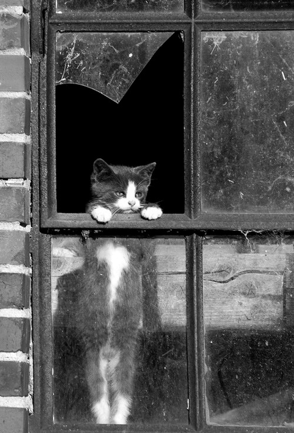

# cats
Tool that downloads a random cat image from The Cat API, implemented in Go.

## Installation
Install [Go](https://golang.org/doc/install)

To install the binary to your current directory:

`GOBIN="$(pwd)" GOPATH="$(mktemp -d)" go get github.com/simmonsritchie/cats`

## Examples

Random cat:

