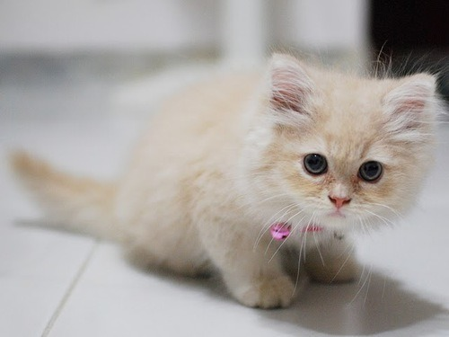

# cats
CLI tool that downloads a random cat image from [The Cat API](https://thecatapi.com/), implemented in Go.

## Installation
First install [Go](https://golang.org/doc/install).

Then, to install the binary to your current directory, run the following command:

`GOBIN="$(pwd)" GOPATH="$(mktemp -d)" go get github.com/simmonsritchie/cats`

## Usage

```
  -o string
        output path for cat image (default "./cat.jpg")
  -v    log messages to stdout
```

## Example cats




## API key

By default, cats fetches data from [The Cat API](https://thecatapi.com/) without an API key. The Cat API allows requesters to return a small amount of data without using one, which is all that this tool needs.

However, heavy users of cats may encounter rate limiting without use of an API key. You can sign up for a key for free on the website of [The Cat API](https://thecatapi.com/). You can then provide it to cats as an environment variable before execution.

On Mac/linux, run the following, replacing 'xxxx' with your key:

`export API_KEY=xxxx`

Or you can set it in an .env file in the same directory as the binary:

```
// .env file

API_KEY=xxxx
```


